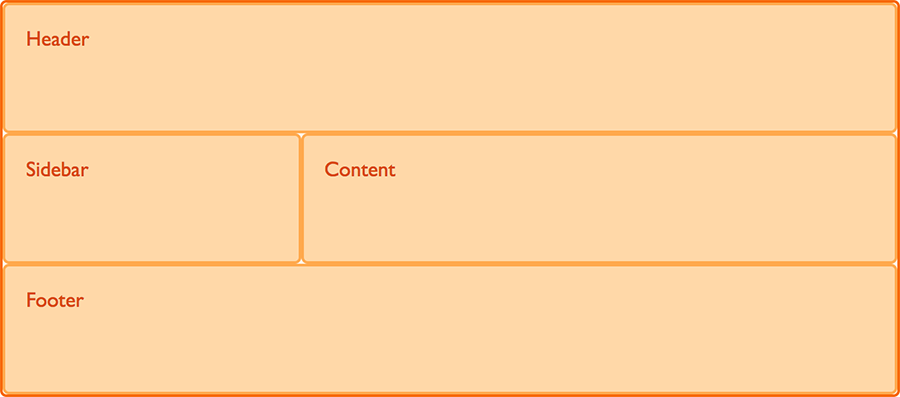

# 3/30(금)

## 1. Today I learned

### 1-1. html/css
  - grid-area
    - `grid-area` 방식은 영역에 이름을 지정하여 처리하는 방식이다.
      
      ```css
          /* 간단한 사용방법 예제 */

         .header {
           grid-area: hd;
          }
        .footer {
           grid-area: ft;
          }
        .content {
           grid-area: main;
          }
        .sidebar {
           grid-area: sd;
          }

          /* 먼저 그리드 영역을 적용시킬 각 영역들에 grid-area를 이용해 이름을 정의한다 */

        .wrapper {
          display: grid;
          grid-template-columns: repeat(9, 1fr);
          grid-auto-rows: minmax(100px, auto);
          grid-template-areas: 
          "hd hd hd hd   hd   hd   hd   hd   hd"
          "sd sd sd main main main main main main"
          "ft ft ft ft   ft   ft   ft   ft   ft";
          /* 위 처럼 전체 레이아웃을 그리드의 이름을 이용해서 직접 정의한다 */
          }
      ```
      
      <적용된 예>

      * 출처 - [MDN](https://developer.mozilla.org/ko/docs/Web/CSS/CSS_Grid_Layout/%EA%B7%B8%EB%A6%AC%EB%93%9C_%ED%85%9C%ED%94%8C%EB%A6%BF_%EC%98%81%EC%97%AD)

  - strong, em
    - 일단은 시각적으로 보면 `strong`, `em` 태그는 글씨체를 지정하는 태그처럼 보이지만, 웹 표준적 관점으로 얘기하면 태그를 강조하는 태그이다. 웹 브라우저 뿐만 아니라 다른 음성 읽기 도구에서도 강조해서 읽어주기 때문에 이 같은 태그들은 문서의 구조를 나타내는 태그라고 정의할수 있다.
      ```html
        <!-- 기본적인 사용 예 -->
        <strong>one</strong>
        <!-- strong은 글자를 굵게 -->
        <em>two</em>
        <!-- em은 이탤릭체-->
      ```
      - 일반적으로는 이렇게 사용하지만 문장 내에서 강조하는 것이 아닐 경우에는 css를 활용하는것이 더 바람직하다.
  
  - figure
    - `figure` 태그는 HTML5에서 추가된 태그며, 웹페이지에 첨부자료를 삽입하고 추가로 캡션을 삽입하는 태그이다.
      ```html
      <!-- 기본적인 사용 예 -->
      <figure>
      
      <figcaption>그리드 레이아웃 입니다.</figcaption>
      </figure>
      ```
      - 결과
      
  
  - dl,dt,dd
    - 위 태그 들은 용어를 정의 할 때 사용하는 태그 들이다.

      - `dl` : Definition List 의 약자로 용어를 설명하는 목록을 만들 때 사용한다.
      - `dt` : Definition term 의 약자로 정의되는 용어의 제목을 넣을 때 사용한다.
      - `dd` : Definition description 의 약자로 용어를 설명할 때 사용한다.     
  
## 2. Today I found out

## 3. Ref
  - [자바스크립트 스타일 가이드](https://www.vobour.com/%EA%B5%AC%EA%B8%80%EC%9D%80-%EC%9E%90%EB%B0%94-%EC%8A%A4%ED%81%AC%EB%A6%BD%ED%8A%B8-%EC%8A%A4%ED%83%80%EC%9D%BC-%EA%B0%80%EC%9D%B4%EB%93%9C%EB%A5%BC-%EB%B0%9C%ED%96%89-%ED%95%A9%EB%8B%88%EB%8B%A4-%EB%8B%A4%EC%9D%8C%EC%9D%80-%EB%AA%87-%EA%B0%80%EC%A7%80-%ED%95%B5%EC%8B%AC)

  - [한국형 웹 접근성 지침](http://www.wah.or.kr/)
  