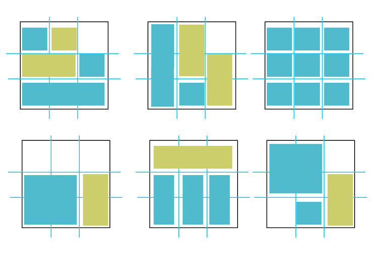

# 3/27(화)

## 1. Today I learned

### 1-1. css
 - <strong>정렬</strong>
   - `text-align` : block 요소 안에 있는 inline 요소를 정렬 합니다. 
     - <strong>inline</strong> 요소 : 줄 속에 끼워 넣는 요소로 쉽게 말해 줄을 바꾸지 않고 다른 요소와 함께 한 행에 위치하는 속성. 문장 안에서 사용하는 태그, 대표적으로 `<span>`,`<b>`,`<a>`,`` 태그 등이 있다.

      
    -  ex)
        ```css 
        text-align:left :    /* 왼쪽 정렬 */
        text-align:right :   /* 오른쪽 정렬 */
        text-align:center :  /* 가운데 정렬 */
        text-align:justify : /* 양쪽 정렬, 왼쪽과 오른쪽 
                          열에 맞추어 화면을 늘어뜨린다.*/
       ```
   - `vertical-align` : 텍스를 정렬하는 속성 중 수직 정렬을 할 수 있으며 block 요소가 아닌 inline이나 inline-block 에서만 가능하다. 이유는 행 방향으로 나열된 요소들

- <strong>속성 선택자</strong> 
  - 속성 선택자는 주어진 속성 및 속성값을 선택자로 사용하여 요소의 스타일을 선언한다.
   ```
   <특정속성을 가진 HTML태그를 선택>
    * 선택자[속성] - 특정한 속성이 있는 태그를 선택
    * 선택자[속성=값] - 특정한 속성안의 값이 특정값일때 선택
  ``` 
     
    -  ex)
        ```css 
        input[type="search"]{
        height: 35px;
        width: 400px;
        padding: 2px 2px 2px 10px;
        border: 1px solid #666;
        border-radius: 50px;
        /* input 태그중 type 속성이 search로 끝나는 태그에 적용*/
        }
        ```

 - <strong>position</strong>
   - 포지션이란 이름처럼 태그들의 위치를 결정하는 css이다. 레이아웃을 배치하거나, 객체를 위치시킬때 사용할 수 있는 속성.

     - `position:static` : 일단 모든 태그들은  기본적으로 처음에  static 상태이다. 보통 static을 사용할 일이 없지만, 앞에 설정된 position을 무시할 때 사용되기도 한다.
     - `position:relative` : 태그의 위치를 살짝 변경하고 싶을 때 사용하며 이때 위치 계산을 할 때 static의 원래 위치부터 계산하고 top,bottom,left,right 속성을 사용해 위치를 조절할 수도 있다.
     - `position:absolute` : absolute는 relative와 달리 문서의 원래 위치와 상관없이 위치를 지정 할 수 있다. static 속성을 가지고 있지 않는 부모를 기준으로 움직인다. 만약 부모 중에 포지션이 relative,absolute,fixed인 태그가 없다면 가장 위의 태그(body)가 기준이 된다.
     - `position:fixed` : 브라우저 화면의 상대 위치 이며 화면이 바뀌더라도 고정된 위치를 설정할 수 있다.(상위 요소에 영향을 받지 않음)
     - `position:sticky` : fixed와 마찬가지로 브라우저 화면 기준 지정한 오프셋에 고정되서 보이지만 스크롤을 내리다가 지정한 오프셋에 위치하고 나서부터 계속 그위치에 고정된다. 


- <strong>Grid Layout</strong>
   - css grid layout은 페이지를 여러 주요 영역으로 나누거나, 크기와 위치 및 문서 계층 구조의 관점에서 HTML 기본 요소로 작성된 control간의 관계를 정의하는데 좋은 레이아웃이다.

   - gird layout은 세로 열과 가로 행을 기준으로 요소를 정렬 할 수 있다. 웹사이트의 일정 수의 grid로 나누고 그 각각의 grid 속에 필요한 디자인 요소를 적절하게 배치하는 방법.

     
    
    -  ex)
        ```css 
        .header{
         display: -ms-grid;
         display: grid;
         -ms-grid-columns: 30% 70%;
         -ms-grid-rows: 50px 50px;
         grid-template-columns: 30% 70%;
         grid-template-rows: 50px 50px;
         grid-column-gap: 20px;
        }
        ```
  
    - 그 외
      - explorer에서 grid를 쓰려면 앞에 prefix로 -ms-를 붙혀 주어야 한다. prefix가 붙어있는 코드는 항상 표준코드 위에 선언을 해주어야한다.


## 2. Today I found out
  - 그리드 레이아웃과 포지션이 오늘의 주된 내용이었다. 매일이 늘 새롭지만 수업을 따라가는데는 그렇게 지장이 많지는 않지만 오늘 그리드 레이아웃은 다른 레이아웃에 비해 더 헷갈리는 느낌이다. 그리고 markdown 파일을 작성하면서 이미지 링크를 걸었을때 vscode뷰어에서는 보이지만 github에서는 보이지 않았다. 확인결과 원인은 github에 push한 markdown 파일을 확인해보니 이미지의 확장자명의 대소문자까지 이미지 파일과 일치해야 됬었다..;;

## 3. Ref
 - [usefulparadigm](http://www.usefulparadigm.com/2017/03/31/a-few-ways-to-make-a-grid-layout/)
 - [W3C](https://www.w3.org/)