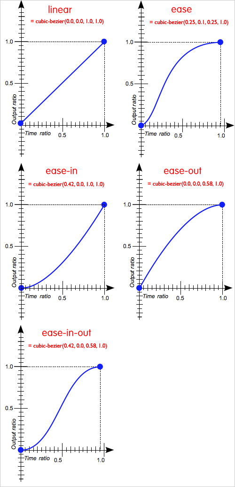

# 3/29(목)

## 1. Today I learned

### 1-1. html/css
 - font

   - `line-height` : 블록 엘리먼트에서, `line-height`는 텍스트를  싸고 있는 기본라인의 높이를 설정하는 속성을 뜻한다.
   이 값에 의해 라인 박스의 높이가 늘어나거나 줄어들곤 한다. `line-height`는 글자 크기, 글자 색상과 같은 기본속성은 상속되는 성질을 갖고있다.
   
   - `line-height` 문법
       1. `normal`   - 기본값이며, 브라우저의 기본 속서을 따른다, 폰트에 따라 다르지만 보통 1.2정도 할당되어 있다

       2. `길이`     - 직접 수치를 할당 할 수있다.

       3. `숫자`     - 폰트 사이즈를 기준으로 설정한 숫자만큼 
       배율로 적용한다. 가장 문제없이 동작하고, 또 가장 선호되는 방식.

       4. `퍼센트`   - 폰트 사이즈 기준으로 설정한 퍼센트만큼 배율로 적용한다.

   - `line-height`를 지정하는 방법
       ```
       1. normal
        ex)p {line-height: normal ;}
       2. 길이 단위 값(px,em 등)을 사용해서 지정.
        ex)p {line-height: 20px ;}      
       3. 숫자 값을 사용해서 지정.
        ex)p {line-height: 1.3 ;}      
       4. 퍼센트 값으로 지정.
        ex)p {line-height: 120% ;}
       ```
 - text-shadow 속성

   - `text-shadow` : 기본적으로 텍스트에 그림자를 표현하기 위한 속성이며, 콤마로 구분된 그림자 설정정보 리스트가 `text-decorations`속성에 적용될 수 있다.

   - `text-shadow` 문법

       ```css
       선택자{text-shadow:offset-x, offset-y, blur-radius, color};
       ```
       `offset-x,y` : 이 둘은 필수정보이며 양수를 입력시 아래나 우측, 음수를 입력시 위쪽과 좌측에 글자가 깔리게 된다. 
       x는 수평 그림자 위치를 나타내며, y는 수직 그림자 위치를 나타낸다.

       `blur-radius` : 선택지정이며 그림자가 퍼지는 거리를 나타낸다. 기본값이 0이고 생략가능하며, 숫자가 높아질수록 점점 흐릿해진다.

       `color` : 선택지정, 그림자 색깔

       ※ 쉼표로 분리하여 여러개의 그림자를 만들 수 있다.
       ```css
       ex)
       text-shadow: 0px 1px 0px #000, 1px 0px 0 #000;
       ```

 - transition
   - `transition` : transition이란 마우스를 click하거나 hover, focus같은 interection이 발생했을 때 CSS값의 변화가 지정한 시간동안 부드러운 애니메이션 효과로 표현되는것을 말한다.

   - transition 문법

       ```css
       transition-property:color;  
       transition-duration: 1s;  
       transition-timing-function: ease;  
       transition-delay: .5s;  
       /* 단축 표기법 */
       transition: width 1s ease .5s; 
       transition: property, duration, -timing-function, delay;
       /* 스페이스 빈 공백으로 구분하며 편의상 (,) 를 써놨습니다. */
       ```

       `transition-property` : css 속성을 지정하며 어떤 속성에 transition 효과를 줄지를 설정한다. 모든 속성이 transition 효과를 받고 싶을때는 `all`(일일이 property를 적어주지 않아도 된다)을 선언하면 된다.

       `transition-duration` : 트랜지션 실행시간, 변화가 몇 초 , 또는 몇 밀리 세컨드애 걸쳐 일어날지를 결정짓는다. 이 속성은 항상 `transition-property`와 같이 지정해 주어야 하며 그렇지 않을 경우 기본값이 0s로 설정되는데 아무런 효과가 나타지않아 사실상 transtion을 쓰는데 의미가 없게된다.

       `transition-timing-function` : transtion 효과가 진행하는 동안 속도의 변화를 설정하는 것이며, 끝에서의 가속 곡선을 선택한다.

       ```
       ease - 처음에는 천천히 시작하고 점점 빨라지다가 마지막엔 천천히 끝남, 기본값.

       linear - 처음과 끝이 같은 속도로 transtion을 진행함.
       
       ease-in - 시작을 느리게함, 시작지점의 변화가 천천히 진행.
       
       ease-out - 끝을 느리게함, 종료지점의 변화가 천천히 진행.
       
       ease-in-out - 느리게 시작하고 느리게 끝남
       
       cubic-bezier(n,n,n,n) - 직접 함수 값을 지정할수 있으며  n에서 사용할수 있는 값은 0에서 1사이이다.
       ```

       
       
       - linear, ease, ease-in, ease-out, ease-in-out 의 cubic bezier 그래프  

       `transition-delay` : transition 효과가 언제 시작할지를 설정한다. 말 그대로, delay를 설정하는 것이며, 이 속성에서 지정하는 시간만큼 기다렸다가 트랜지션이 시작된다. 

 - animation
   - `@keyframes` : 먼저 애니메이션 설명에 앞서 우리는  `@keyframes` 이 속성을 먼저 알고 들어가야한다. @keyframes는 애니메이션에서 가장 중요한 요소로써 @keyframes안에서 스테이지(구간)를 정의하고 객체가 시간의 흐름에따라 어떻게 변형될 지 모양새에 관련된 선언을 한다. @keyframes을 선언하는 방식에는 `from`. `to`, `%`가 있지만 좀더 세분화 시켜서 움직임을 표현하는 방식에는 `%`를 사용하는 것이 일반적이다.

       ```css
       @keyframes text{
        0%{
        font-size: 20px;
         }
        100%{
        font-size: 40px;
         }
        }
       ```
       - 위 코드에서는 글꼴크기 20px 에서 시작해서 100%에 다다랐을 때에는 40px로 커지게 됩니다.
  
   - `animation` : animation은 element에 적용되는 css 스타일을 다른 css 스타일로 부드럽게 전환 시켜주는 역할을 한다. animation 속성에서는 타이밍, 지연시간, 반복, 상태 등 움직임에 관한 선언을 한다.

   - animation 문법 :  
       ```css
        animation-name: text-ani;
        animation-duration: 3000ms;
        animation-fill-mode: forwards;
        animation-delay: 0s;
        animation-iteration-count: infinite;
        animation-direction: alternate;
        animation-timing-function: ease-in-out;
        animation-play-state: paused; 
        /* 단축 표기법 */
        animation: text-ani 3000ms forwards 0s infinite alternate ease-in-out;
        
        animation: name, duration, fill-mode, delay, iteration-count, direction, timing-function;

        /* 스페이스 빈 공백으로 구분하며 편의상 (,) 를 써놨습니다. */
       ```

       `animation-name` : animation 이름이며 `@keyframes` 애니메이션 이름{} 으로 쓰인다.

       `animation-duration` : animation의 진행시간을 나타내며, 시작부터 마지막까지 총 지속시간을 나타낸다.

       `animation-fill-mode` : animation이 시작되기 전이나 끝나고 난 후 어떤 값이 적용될지(상태제어) 지정한다.(none/ forwards/ backwards/ both)

       `animation-delay` : 로드 되고나서 언제 animation이 시작될지 지정하며 시작하기전에 기다려야 하는 시간이다.

       `animation-iteration-count` : animation이 몇 번 반복될지 지정하며, `infinite`로 지정하여 무한히 반복하게 할 수도있다.

       `animation-direction` : animation이 종료되고 나서 루프(loop)의 방향을 처음부터 시작할지 역방향으로 시작할지 지정한다.

       `animation-timing-function` : animation의 속도(가속/감속, 시간간격 등)를 조절하며 움직임의 긴장감, 어떻게 지정하느냐에 따라 부드러워질 수도 있고, 통통 튀는 animation을 설정할 수 있다.(linear/ ease/ ease-in/ ease-out/ ease-in-out/ cubic-bezir)

       `animation-play-state` : animation의 시작 또는 정지상태. 기본적으로 `running`, `paused`를 쓸 수 있으며 `running`이 기본 상태이다. 기본 상태 일 때, animation 지속시간과 animation 이름이 정의되면 자동으로 재생되기 시작한다. `paused`는 첫 번째 키 프레임에서 animation을 일시중지 시키는 값이다.

     ※ [Animate.css](https://daneden.github.io/animate.css/) 이 사이트에서 animate.css 를 다운받고 레퍼런스를 참고해 원하는 태그에 클래스만 적용되면 쉽게 사용할 수 있다.(학습용으로 참고해도 많이 도움될 것 같다)

## 2. Today I found out
  - `line-height`는 inline 요소를 잘 알려면 중요한 개념이다.
  - 애니메이션과 트랜지션 둘 다 선택자를 선언함과 같이 `duration` 속성도 함께 써줘야 한다.
  - 둘 다 속기법이 있으며, `all`을 쓰면 일일이 property를 적어주지 않아도 된다.

## 3. Ref
 - [Animate.css](https://daneden.github.io/animate.css/)